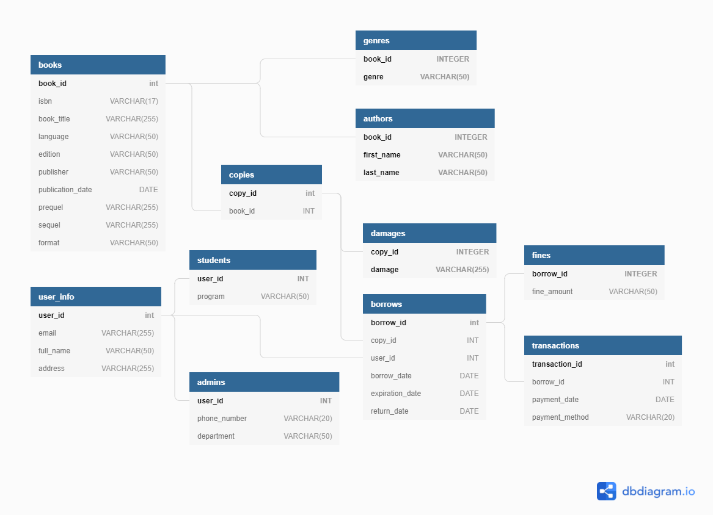
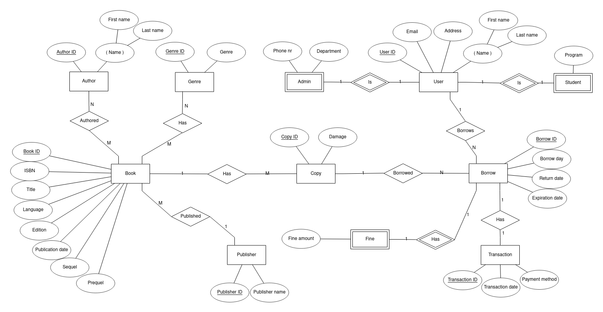

# dBas

## Schemas:

### Books:

Books(<ins>Book ID:</ins> integer, ISBN: string, Book title: string, Language: string, Edition: string, Publisher: string, Publication date: date, Prequel: string, Sequel: string)

Copy(<ins>Copy ID:</ins> integer, Book ID: integer)

Authors(<ins>Book ID:</ins> integer, <ins>First name:</ins> string, <ins>Last name:</ins> string)

Genres(<ins>Book ID:</ins> integer, <ins>Genre:</ins> string)

Damages(<ins>Copy ID:</ins> integer, <ins>Damage:</ins> string) 

### User info:

Admins(<ins>User ID:</ins> integer, Phone number: string, Department: string)

Students(<ins>User ID:</ins> integer,  Program: string)

UserInfo(<ins>User ID:</ins> integer, Full name: string, Email: string, Address: string)

### Borrows:

Borrowed book(<ins>Borrow ID:</ins> integer, Copy ID: integer, User ID: integer, Borrow date: date, Expiration date: date, Return date: date)

Fines(<ins>Borrow ID:</ins> integer, Fine amount: float)

Transactions(<ins>Transaction ID:</ins> integer, Borrowing ID: integer, Date of Payment: Date, Payment method: string)

 

## Useful resources:

### SSH into KTH remote system 
ssh kth-id@student-shell-1.sys.kth.se
  
### Log into KTH psql database
psql -h psql-dd1368-ht21.sys.kth.se

### Send a file from a directory on your pc to KTH database
scp \~/Downloads/dbas.sql lvainio@student-shell-1.sys.kth.se:\~/filepath

### Run .sql script file in KTH psql database
psql -h psql-dd1368-ht21.sys.kth.se -f 'filepath'

### Foreign key example 
CREATE TABLE IF NOT EXISTS copy (  
&nbsp;&nbsp;&nbsp;&nbsp;&nbsp;&nbsp;    copy_id 		SERIAL,  
&nbsp;&nbsp;&nbsp;&nbsp;&nbsp;&nbsp;    book_id		  INT,  
&nbsp;&nbsp;&nbsp;&nbsp;&nbsp;&nbsp;    PRIMARY KEY (copy_id),  
&nbsp;&nbsp;&nbsp;&nbsp;&nbsp;&nbsp;    FOREIGN KEY (book_id) REFERENCES books (book_id)  
); 

https://www.postgresqltutorial.com/postgresql-foreign-key/

### Create database visualisation
https://dbdiagram.io/d

### Setting up github ssh connection on KTH-remote server
https://www.youtube.com/watch?v=Sp5AASmX4no  

### After ^^ type the following to clone this repo to KTH-remote server
git clone git@gits-15.sys.kth.se:lvainio/dbas.git

### Create ER-diagram
https://erdplus.com/  
https://www.lucidchart.com/  
https://www.youtube.com/watch?v=CZTkgMoqVss
